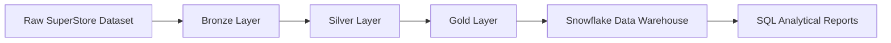
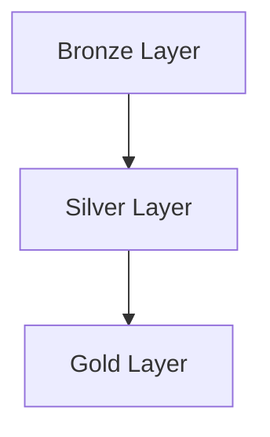
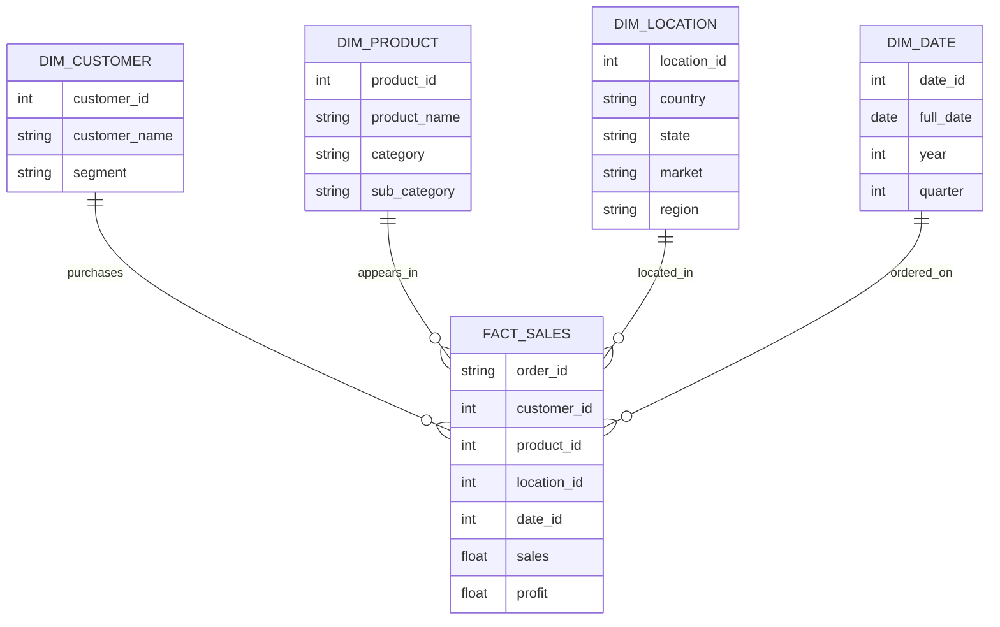
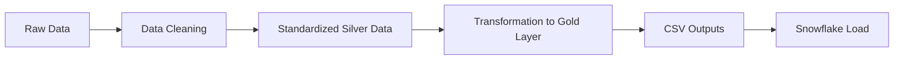

# Customer Order Analytics

## Project Overview

Customer Order Analytics is an end-to-end data engineering project that transforms raw customer order data into a structured analytical dataset for business reporting. The pipeline follows Medallion Architecture and loads the processed data into Snowflake for downstream analysis.

## Business Problem

Organizations need a reliable way to understand customer purchasing behavior, revenue contribution, product performance, and repeat buying patterns. This project addresses that need by turning raw transaction data into curated datasets that support analytical reporting and decision-making.

## Solution Overview

The solution moves data through three layers:

1. Bronze: raw source data stored as a CSV file
2. Silver: cleaned and standardized data prepared for analysis
3. Gold: star schema tables and business metrics designed for reporting

The process is automated with Python scripts and delivered to Snowflake for storage and query access.

## Project Architecture



## Medallion Architecture

The project uses simplified Medallion Architecture to improve data quality progressively as it moves from raw to curated forms.



| Layer | Purpose |
| --- | --- |
| Bronze | Stores the original raw CSV data without modification |
| Silver | Cleans, validates, and standardizes data for analytics |
| Gold | Produces reporting-ready tables and metrics |

## Star Schema Design

The Gold layer uses a star schema to support efficient analytical reporting. Dimension tables describe customers, products, locations, and dates, while the fact table stores transactional sales data.



A star schema is used because it simplifies reporting, improves query performance, and makes business analysis easier to understand.

## Technology Stack

- Python
- Pandas
- Snowflake
- Snowflake SQL
- Git and GitHub
- VS Code

## Project Folder Structure

```text
Customer-Order-Analytics/
├── data/
│   ├── bronze/
│   ├── silver/
│   └── gold/
├── docs/
├── notebooks/
├── scripts/
│   ├── data_cleaning.py
│   ├── transformation.py
│   └── snowflake_loader.py
├── sql/
├── README.md
└── requirements.txt
```

## ETL Pipeline Workflow



The workflow is implemented through the following scripts:

- scripts/data_cleaning.py for Bronze-to-Silver processing
- scripts/transformation.py for Gold-layer transformations and metrics
- scripts/snowflake_loader.py for automated Snowflake loading

## Snowflake Integration

The project connects to Snowflake and performs the following steps automatically:

- validates Snowflake connection settings
- creates the target database and schema if needed
- creates the required tables
- loads Bronze, Silver, and Gold data into Snowflake
- validates row counts after loading


## SQL Analytics Reports

The project includes reporting logic for business-facing analytical questions. These reports help answer practical questions such as:

- Top Customers by Revenue: identifies the highest-value customers
- Revenue by Region: shows where revenue is concentrated geographically
- Revenue by Segment: highlights performance across customer segments
- Monthly Sales Trend: reveals sales movement over time
- Top Products: shows which products drive the most revenue
- Profit by Category: evaluates profitability by product category
- Customer Lifetime Value: estimates the long-term value of each customer
- Repeat Customers: identifies customers with multiple purchases
- Average Order Value: measures the average spending per order


## Key Features

- Automated ETL workflow from raw data to analytics-ready output
- Clean silver layer with validated data quality checks
- Gold layer built as a star schema for reporting
- Snowflake integration for warehouse-based storage and analysis
- Business-focused metrics for customer and sales analysis

